# High-Level Design (HLD)
## Data Sentry - Business Data Scraping & Automation System

**Version:** 1.0  
**Date:** November 29, 2025  
**Author:** Ali Haidar  
**Status:** Design Phase

---

## Table of Contents

1. [Executive Summary](#1-executive-summary)
2. [System Overview](#2-system-overview)
3. [Architecture Design](#3-architecture-design)
4. [Component Design](#4-component-design)
5. [Data Flow](#5-data-flow)
6. [Technology Stack](#6-technology-stack)
7. [API Design](#7-api-design)
8. [Database Schema](#8-database-schema)
9. [Security & Privacy](#9-security--privacy)
10. [Scalability & Performance](#10-scalability--performance)
11. [Error Handling & Resilience](#11-error-handling--resilience)
12. [Deployment Architecture](#12-deployment-architecture)
13. [Monitoring & Logging](#13-monitoring--logging)
14. [Future Enhancements](#14-future-enhancements)

---

## 1. Executive Summary

### 1.1 Purpose
Data Sentry is a production-grade, asynchronous web scraping and data automation platform designed to extract, normalize, store, and synchronize business data from web sources to Google Sheets with intelligent alerting capabilities.

### 1.2 Business Value
- **E-commerce**: Competitive price monitoring and market intelligence
- **Real Estate**: Automated listing tracking and deal detection
- **Arbitrage**: Multi-source price comparison and opportunity alerts
- **Marketing**: Lead generation and competitor analysis
- **Local Business**: Supplier price tracking and inventory monitoring

### 1.3 Key Differentiators
- High-concurrency async architecture (100+ concurrent requests)
- Production-grade error handling and retry mechanisms
- Real-time Google Sheets synchronization
- Multi-channel alerting (Email, Slack, Discord)
- Proxy rotation and anti-ban measures
- RESTful API for programmatic control
- Docker-based deployment with one-command startup

---

## 2. System Overview

### 2.1 System Context Diagram

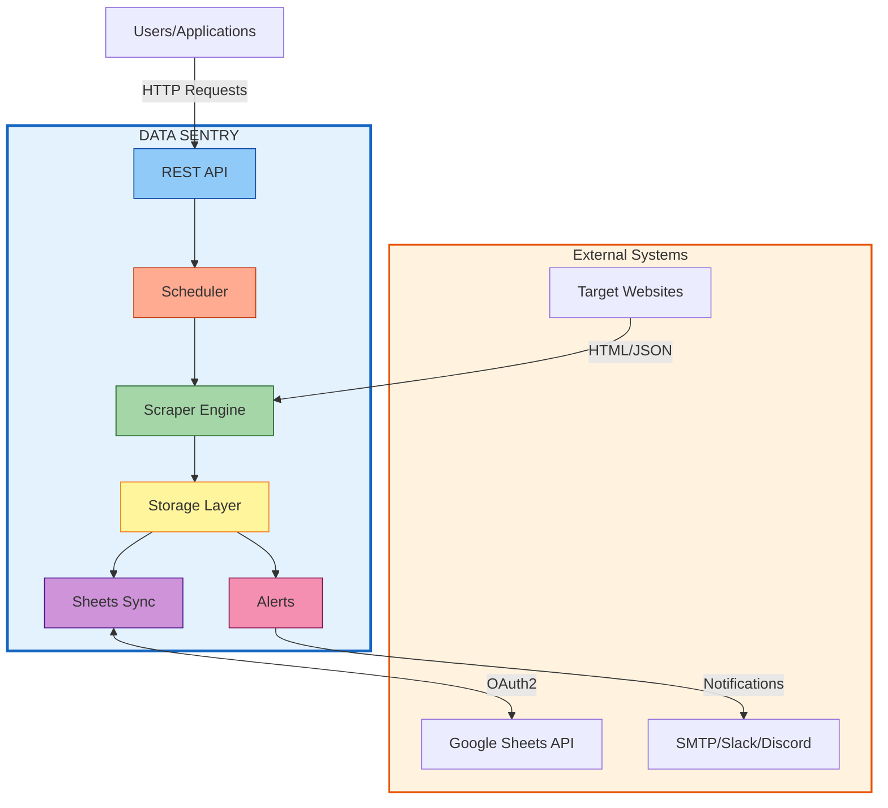

### 2.2 High-Level Capabilities

| Capability | Description | Priority |
|------------|-------------|----------|
| **Async Scraping** | Concurrent HTTP requests with rate limiting | P0 (MVP) |
| **Data Normalization** | Clean, validate, and transform raw data | P0 (MVP) |
| **Storage** | CSV export and SQLite persistence | P0 (MVP) |
| **Sheets Sync** | OAuth2-based Google Sheets integration | P0 (MVP) |
| **Change Detection** | Diff-based monitoring and alerting | P0 (MVP) |
| **Proxy Rotation** | Anti-ban IP rotation | P1 |
| **REST API** | Programmatic control interface | P1 |
| **Scheduling** | Cron-style automated jobs | P1 |
| **Authentication** | Login to protected sites | P2 |
| **Web UI** | Dashboard for non-technical users | P3 |

---

## 3. Architecture Design

### 3.1 Layered Architecture

```mermaid
flowchart TB
    subgraph PresentationLayer["Presentation Layer"]
        API["REST API<br/>(FastAPI)"]
        CLI["CLI Interface<br/>(argparse)"]
    end
    
    subgraph BusinessLogic["Business Logic Layer"]
        SCRAPER["Scraper<br/>Engine"]
        NORMALIZER["Normalizer"]
        SCHEDULER["Scheduler"]
        ALERTS["Alerts<br/>Manager"]
    end
    
    subgraph DataAccess["Data Access Layer"]
        CSV["CSV Store"]
        DB["Database<br/>(SQLite)"]
        SHEETS["Sheets<br/>API"]
    end
    
    subgraph Infrastructure["Infrastructure Layer"]
        LOG["Logging"]
        CONFIG["Config<br/>Manager"]
        DOCKER["Docker"]
    end
    
    PresentationLayer --> BusinessLogic
    BusinessLogic --> DataAccess
    DataAccess --> Infrastructure
    
    style PresentationLayer fill:#bbdefb,stroke:#0d47a1,stroke-width:3px
    style BusinessLogic fill:#ce93d8,stroke:#4a148c,stroke-width:3px
    style DataAccess fill:#a5d6a7,stroke:#1b5e20,stroke-width:3px
    style Infrastructure fill:#ffcc80,stroke:#e65100,stroke-width:3px
    style API fill:#64b5f6,stroke:#0d47a1
    style CLI fill:#64b5f6,stroke:#0d47a1
    style SCRAPER fill:#ba68c8,stroke:#4a148c
    style NORMALIZER fill:#ba68c8,stroke:#4a148c
    style SCHEDULER fill:#ba68c8,stroke:#4a148c
    style ALERTS fill:#ba68c8,stroke:#4a148c
    style CSV fill:#81c784,stroke:#1b5e20
    style DB fill:#81c784,stroke:#1b5e20
    style SHEETS fill:#81c784,stroke:#1b5e20
    style LOG fill:#ffb74d,stroke:#e65100
    style CONFIG fill:#ffb74d,stroke:#e65100
    style DOCKER fill:#ffb74d,stroke:#e65100
```

### 3.2 Architectural Patterns

#### 3.2.1 **Async/Await Pattern**
- All I/O operations are non-blocking
- Event loop manages concurrent tasks
- Maximizes throughput for network-bound operations

#### 3.2.2 **Repository Pattern**
- Abstract data access behind interfaces
- Swap storage backends without affecting business logic
- Enables easy testing with mock repositories

#### 3.2.3 **Strategy Pattern**
- Pluggable parsers for different website structures
- Configurable alert channels (Email, Slack, Discord)
- Multiple export formats (CSV, JSON, Excel)

#### 3.2.4 **Observer Pattern**
- Event-driven change detection
- Subscribers notified on data changes
- Decoupled alert system from scraper

---

## 4. Component Design

### 4.1 Component Interaction Overview

```mermaid
flowchart TB
    subgraph UserInterface["User Interface"]
        CLI["CLI"]
        API_ENDPOINT["REST API"]
    end
    
    subgraph CoreEngine["Core Scraping Engine"]
        FETCHER["Async Fetcher<br/>(aiohttp)"]
        PARSER["HTML Parser<br/>(BeautifulSoup)"]
        NORMALIZER["Data Normalizer<br/>(pandas)"]
    end
    
    subgraph Storage["Storage Layer"]
        CSV_STORE["CSV Export"]
        DB_STORE["SQLite Database"]
        SHEETS_SYNC["Google Sheets"]
    end
    
    subgraph Intelligence["Intelligence Layer"]
        CHANGE_DETECT["Change Detector"]
        ALERT_ENGINE["Alert Engine"]
    end
    
    subgraph Integration["Integrations"]
        EMAIL["Email (SMTP)"]
        SLACK["Slack Webhook"]
        DISCORD["Discord Webhook"]
    end
    
    subgraph Automation["Automation"]
        SCHEDULER["APScheduler"]
    end
    
    CLI --> FETCHER
    API_ENDPOINT --> FETCHER
    SCHEDULER --> FETCHER
    
    FETCHER -->|HTML/JSON| PARSER
    PARSER -->|Raw Data| NORMALIZER
    NORMALIZER --> CSV_STORE
    NORMALIZER --> DB_STORE
    NORMALIZER --> SHEETS_SYNC
    
    DB_STORE --> CHANGE_DETECT
    CHANGE_DETECT -->|Changes Found| ALERT_ENGINE
    ALERT_ENGINE --> EMAIL
    ALERT_ENGINE --> SLACK
    ALERT_ENGINE --> DISCORD
    
    style UserInterface fill:#e1bee7,stroke:#6a1b9a,stroke-width:3px
    style CoreEngine fill:#90caf9,stroke:#0d47a1,stroke-width:3px
    style Storage fill:#a5d6a7,stroke:#1b5e20,stroke-width:3px
    style Intelligence fill:#ffcc80,stroke:#e65100,stroke-width:3px
    style Integration fill:#f48fb1,stroke:#880e4f,stroke-width:3px
    style Automation fill:#80deea,stroke:#00695c,stroke-width:3px
    
    style FETCHER fill:#64b5f6,stroke:#0d47a1,stroke-width:2px
    style PARSER fill:#64b5f6,stroke:#0d47a1,stroke-width:2px
    style NORMALIZER fill:#64b5f6,stroke:#0d47a1,stroke-width:2px
    style CHANGE_DETECT fill:#ffb74d,stroke:#e65100,stroke-width:2px
    style ALERT_ENGINE fill:#ffb74d,stroke:#e65100,stroke-width:2px```\n\n### 4.2 Scraper Engine

#### 4.1.1 **Fetcher Module** (`scraper/fetcher.py`)

**Responsibilities:**
- Async HTTP request execution
- Connection pooling and session management
- Retry logic with exponential backoff
- Rate limiting and throttling
- Proxy rotation (when enabled)
- User-agent randomization

**Key Classes:**

```python
class AsyncFetcher:
    """High-performance async HTTP client"""
    
    def __init__(self, 
                 max_concurrent: int = 50,
                 timeout: int = 30,
                 retry_attempts: int = 3,
                 rate_limit: float = 1.0):
        pass
    
    async def fetch(self, url: str, **kwargs) -> Response:
        """Fetch single URL with retries"""
        pass
    
    async def fetch_all(self, urls: List[str]) -> List[Response]:
        """Fetch multiple URLs concurrently"""
        pass
    
    async def fetch_with_proxy(self, url: str, proxy: str) -> Response:
        """Fetch with specific proxy"""
        pass
```

**Configuration:**
- `MAX_CONCURRENT_REQUESTS`: Number of parallel requests (default: 50)
- `REQUEST_TIMEOUT`: Timeout per request in seconds (default: 30)
- `RETRY_ATTEMPTS`: Max retry attempts (default: 3)
- `RATE_LIMIT_DELAY`: Delay between requests in seconds (default: 1.0)

---

#### 4.1.2 **Parser Module** (`scraper/parser.py`)

**Responsibilities:**
- HTML/JSON parsing
- CSS/XPath selector execution
- Structured data extraction
- Error handling for malformed HTML

**Key Classes:**

```python
class HTMLParser:
    """BeautifulSoup-based HTML parser"""
    
    def parse(self, html: str, selectors: Dict[str, str]) -> List[Dict]:
        """Extract data using CSS selectors"""
        pass
    
    def parse_xpath(self, html: str, xpaths: Dict[str, str]) -> List[Dict]:
        """Extract data using XPath expressions"""
        pass

class JSONParser:
    """JSON API response parser"""
    
    def parse(self, json_str: str, schema: Dict) -> List[Dict]:
        """Extract data based on schema"""
        pass
```

**Selector Configuration Example:**
```yaml
selectors:
  product_name: "h2.product-title"
  price: "span.price"
  availability: "div.stock-status"
  image_url: "img.product-image@src"
```

---

#### 4.1.3 **Normalizer Module** (`scraper/normalizer.py`)

**Responsibilities:**
- Data type conversion
- Currency normalization
- Date/time parsing
- Missing value handling
- Duplicate removal
- Data validation

**Key Classes:**

```python
class DataNormalizer:
    """Clean and normalize scraped data"""
    
    def normalize_currency(self, value: str) -> float:
        """Convert $1,234.56 → 1234.56"""
        pass
    
    def normalize_date(self, value: str) -> datetime:
        """Parse various date formats"""
        pass
    
    def remove_duplicates(self, data: List[Dict], key: str) -> List[Dict]:
        """Deduplicate based on key field"""
        pass
    
    def validate_schema(self, data: Dict, schema: Dict) -> bool:
        """Validate data against schema"""
        pass
```

**Normalization Rules:**
- Currency: Remove symbols, convert to float
- Dates: Standardize to ISO 8601 format
- Strings: Strip whitespace, normalize case
- Numbers: Handle commas, scientific notation
- URLs: Ensure absolute paths

---

### 4.2 Storage Layer

#### 4.2.1 **CSV Store** (`storage/csv_store.py`)

**Responsibilities:**
- Export data to CSV format
- Append mode for incremental updates
- Configurable column ordering

**Key Classes:**

```python
class CSVStore:
    """CSV file storage"""
    
    def save(self, data: List[Dict], filepath: str):
        """Save data to CSV"""
        pass
    
    def append(self, data: List[Dict], filepath: str):
        """Append to existing CSV"""
        pass
    
    def read(self, filepath: str) -> List[Dict]:
        """Read CSV into memory"""
        pass
```

---

#### 4.2.2 **Database Store** (`storage/db_store.py`)

**Responsibilities:**
- SQLite database operations
- Historical data tracking
- Query interface for analytics
- Data versioning

**Schema:**

```sql
CREATE TABLE scrape_runs (
    id INTEGER PRIMARY KEY AUTOINCREMENT,
    job_name TEXT NOT NULL,
    start_time TIMESTAMP DEFAULT CURRENT_TIMESTAMP,
    end_time TIMESTAMP,
    status TEXT CHECK(status IN ('running', 'completed', 'failed')),
    records_fetched INTEGER,
    errors_count INTEGER
);

CREATE TABLE scraped_data (
    id INTEGER PRIMARY KEY AUTOINCREMENT,
    run_id INTEGER REFERENCES scrape_runs(id),
    url TEXT NOT NULL,
    data_json TEXT NOT NULL,  -- JSON blob of scraped fields
    created_at TIMESTAMP DEFAULT CURRENT_TIMESTAMP
);

CREATE TABLE data_changes (
    id INTEGER PRIMARY KEY AUTOINCREMENT,
    item_key TEXT NOT NULL,  -- Unique identifier for tracked item
    field_name TEXT NOT NULL,
    old_value TEXT,
    new_value TEXT,
    detected_at TIMESTAMP DEFAULT CURRENT_TIMESTAMP
);

CREATE INDEX idx_changes_item ON data_changes(item_key);
CREATE INDEX idx_data_run ON scraped_data(run_id);
```

**Key Classes:**

```python
class DatabaseStore:
    """SQLite database interface"""
    
    def save_run(self, job_name: str) -> int:
        """Create new scrape run record"""
        pass
    
    def save_data(self, run_id: int, data: List[Dict]):
        """Bulk insert scraped data"""
        pass
    
    def detect_changes(self, item_key: str, current_data: Dict) -> List[Change]:
        """Compare with previous version"""
        pass
    
    def query(self, sql: str, params: tuple) -> List[Dict]:
        """Execute custom query"""
        pass
```

---

### 4.3 Google Sheets Integration

#### 4.3.1 **Sheets Sync** (`sheets/sync.py`)

**Responsibilities:**
- OAuth2 authentication flow
- Sheet creation and management
- Bulk data insertion
- Update operations
- Conditional formatting (optional)

**Key Classes:**

```python
class SheetsSync:
    """Google Sheets API wrapper"""
    
    def __init__(self, credentials_path: str):
        """Initialize with OAuth2 credentials"""
        pass
    
    def authenticate(self) -> None:
        """Perform OAuth2 flow"""
        pass
    
    def create_sheet(self, title: str) -> str:
        """Create new spreadsheet, return sheet_id"""
        pass
    
    def append_rows(self, sheet_id: str, data: List[List]):
        """Append rows to sheet"""
        pass
    
    def update_range(self, sheet_id: str, range: str, data: List[List]):
        """Update specific range"""
        pass
    
    def format_cells(self, sheet_id: str, rules: List[FormatRule]):
        """Apply conditional formatting"""
        pass
```

**OAuth2 Flow:**
1. Load credentials from `config/credentials.json`
2. Check for existing token in `config/token.json`
3. If no token, initiate browser-based OAuth flow
4. Save refresh token for future use
5. Auto-refresh access token as needed

**API Quota Management:**
- Batch operations to minimize API calls
- Respect rate limits (300 requests/60 seconds per user)
- Implement exponential backoff on quota errors

---

### 4.4 Alert System

#### 4.4.1 **Email Alerts** (`alerts/email.py`)

**Key Classes:**

```python
class EmailAlert:
    """SMTP-based email notifications"""
    
    def __init__(self, smtp_config: SMTPConfig):
        pass
    
    async def send(self, 
                   to: str, 
                   subject: str, 
                   body: str, 
                   html: bool = False):
        """Send email notification"""
        pass
    
    def send_batch(self, recipients: List[str], subject: str, body: str):
        """Send to multiple recipients"""
        pass
```

#### 4.4.2 **Slack Alerts** (`alerts/slack.py`)

**Key Classes:**

```python
class SlackAlert:
    """Slack webhook integration"""
    
    def __init__(self, webhook_url: str):
        pass
    
    async def send(self, message: str, blocks: List[Dict] = None):
        """Send Slack notification"""
        pass
    
    def format_price_alert(self, item: str, old_price: float, new_price: float) -> Dict:
        """Format rich message block"""
        pass
```

#### 4.4.3 **Discord Alerts** (`alerts/discord.py`)

Similar structure to Slack alerts using Discord webhooks.

---

### 4.5 Scheduler

#### 4.5.1 **Job Scheduler** (`scheduler/jobs.py`)

**Responsibilities:**
- Cron-style job scheduling
- Background task execution
- Job history tracking
- Error recovery

**Key Classes:**

```python
class JobScheduler:
    """APScheduler-based job manager"""
    
    def __init__(self):
        self.scheduler = AsyncIOScheduler()
    
    def add_job(self, 
                func: Callable, 
                trigger: str, 
                **kwargs) -> str:
        """Add scheduled job"""
        pass
    
    def remove_job(self, job_id: str):
        """Cancel scheduled job"""
        pass
    
    def start(self):
        """Start scheduler"""
        pass
    
    def stop(self):
        """Gracefully shutdown"""
        pass
```

**Trigger Types:**
- `interval`: Run every X minutes/hours
- `cron`: Run at specific times (e.g., "0 9 * * *")
- `date`: Run once at specific datetime

---

### 4.6 REST API (Optional)

#### 4.6.1 **FastAPI Application** (`api/app.py`)

**Endpoints:**

```
POST   /api/v1/scrape/run          - Start scrape job
GET    /api/v1/scrape/status/{id}  - Check job status
GET    /api/v1/scrape/results/{id} - Get scraped data
POST   /api/v1/scrape/schedule     - Schedule recurring job
DELETE /api/v1/scrape/schedule/{id}- Cancel scheduled job
GET    /api/v1/data/export         - Export data (CSV/JSON)
POST   /api/v1/alerts/config       - Configure alert rules
GET    /api/v1/health              - Health check
```

**Request/Response Examples:**

```json
// POST /api/v1/scrape/run
{
  "urls": ["https://example.com/products"],
  "selectors": {
    "title": "h1.product-name",
    "price": "span.price"
  },
  "export_to_sheets": true,
  "sheet_name": "Products"
}

// Response
{
  "job_id": "abc123",
  "status": "running",
  "started_at": "2025-11-29T10:30:00Z"
}
```

---

## 5. Data Flow

### 5.1 Complete Scraping Workflow

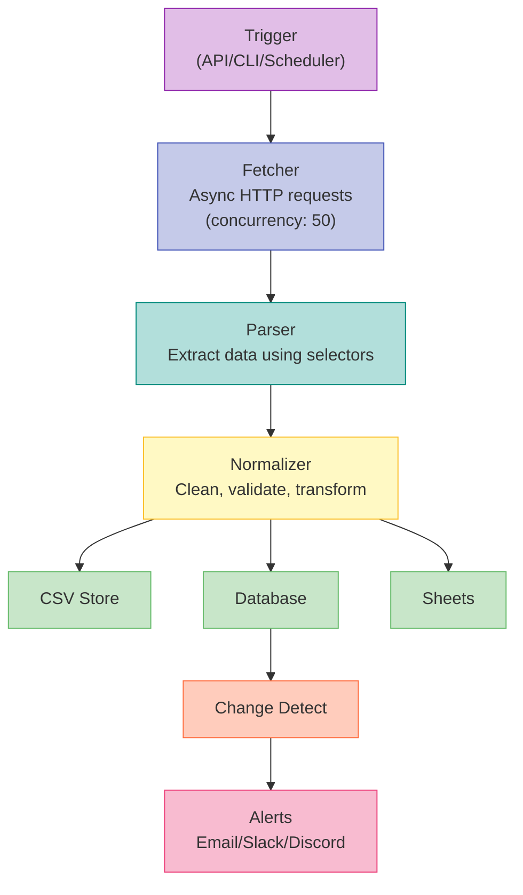

### 5.2 Change Detection Flow

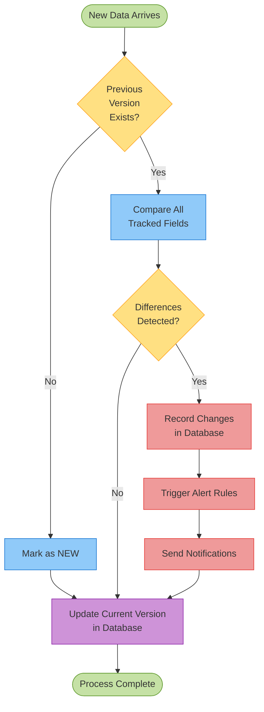

---

## 6. Technology Stack

### 6.1 Core Technologies

| Layer | Technology | Version | Purpose |
|-------|------------|---------|---------|
| **Language** | Python | 3.9+ | Core runtime |
| **Async Runtime** | asyncio | 3.9+ | Event loop |
| **HTTP Client** | aiohttp | 3.9+ | Async requests |
| **HTML Parsing** | BeautifulSoup4 | 4.12+ | DOM parsing |
| **XML Parsing** | lxml | 4.9+ | XPath support |
| **Data Processing** | pandas | 2.0+ | Data manipulation |
| **Database** | SQLite | 3.x | Local persistence |
| **ORM** | SQLAlchemy | 2.0+ | Database abstraction |

### 6.2 Integration Technologies

| Service | Library | Purpose |
|---------|---------|---------|
| **Google Sheets** | gspread | Sheets API wrapper |
| **OAuth2** | google-auth | Authentication |
| **Email** | aiosmtplib | Async SMTP |
| **HTTP API** | FastAPI | REST endpoints |
| **Validation** | Pydantic | Data validation |
| **Scheduling** | APScheduler | Cron jobs |

### 6.3 DevOps & Quality

| Tool | Purpose |
|------|---------|
| **Docker** | Containerization |
| **docker-compose** | Multi-container orchestration |
| **pytest** | Unit/integration testing |
| **pytest-asyncio** | Async test support |
| **pytest-cov** | Code coverage |
| **black** | Code formatting |
| **flake8** | Linting |
| **mypy** | Type checking |

---

## 7. API Design

### 7.1 RESTful API Specification

#### Authentication
```
Authorization: Bearer <API_KEY>
```

#### Common Response Structure
```json
{
  "success": true,
  "data": { ... },
  "error": null,
  "timestamp": "2025-11-29T10:30:00Z"
}
```

#### Error Response
```json
{
  "success": false,
  "data": null,
  "error": {
    "code": "INVALID_SELECTOR",
    "message": "CSS selector 'div.invalid' returned no results",
    "details": { ... }
  },
  "timestamp": "2025-11-29T10:30:00Z"
}
```

### 7.2 CLI Interface

```bash
# Basic scraping
data-sentry scrape --url https://example.com --selector ".product" --output products.csv

# With Google Sheets
data-sentry scrape --config config.yaml --sheets "My Sheet"

# Schedule job
data-sentry schedule --job price-monitor --interval 3600

# Export data
data-sentry export --format csv --output data.csv
```

---

## 8. Database Schema

### 8.1 Database Entity Relationship Diagram

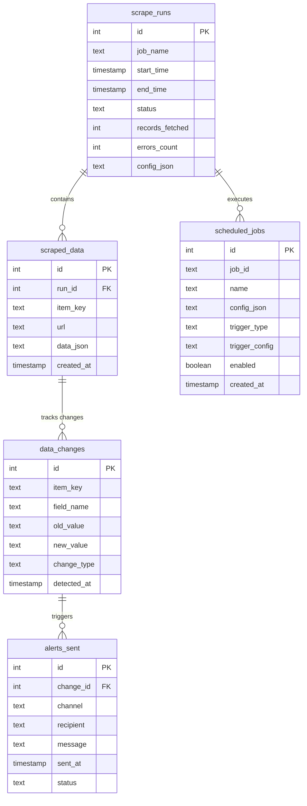

### 8.2 Complete Schema (SQLite)

```sql
-- Scraping job runs
CREATE TABLE scrape_runs (
    id INTEGER PRIMARY KEY AUTOINCREMENT,
    job_name TEXT NOT NULL,
    start_time TIMESTAMP DEFAULT CURRENT_TIMESTAMP,
    end_time TIMESTAMP,
    status TEXT CHECK(status IN ('running', 'completed', 'failed')),
    records_fetched INTEGER DEFAULT 0,
    errors_count INTEGER DEFAULT 0,
    config_json TEXT  -- Store job configuration
);

-- Scraped data (versioned)
CREATE TABLE scraped_data (
    id INTEGER PRIMARY KEY AUTOINCREMENT,
    run_id INTEGER REFERENCES scrape_runs(id) ON DELETE CASCADE,
    item_key TEXT NOT NULL,  -- Unique identifier (e.g., product SKU)
    url TEXT NOT NULL,
    data_json TEXT NOT NULL,  -- Full JSON data
    created_at TIMESTAMP DEFAULT CURRENT_TIMESTAMP
);

-- Change history
CREATE TABLE data_changes (
    id INTEGER PRIMARY KEY AUTOINCREMENT,
    item_key TEXT NOT NULL,
    field_name TEXT NOT NULL,
    old_value TEXT,
    new_value TEXT,
    change_type TEXT CHECK(change_type IN ('NEW', 'UPDATED', 'DELETED')),
    detected_at TIMESTAMP DEFAULT CURRENT_TIMESTAMP
);

-- Scheduled jobs
CREATE TABLE scheduled_jobs (
    id INTEGER PRIMARY KEY AUTOINCREMENT,
    job_id TEXT UNIQUE NOT NULL,  -- APScheduler job ID
    name TEXT NOT NULL,
    config_json TEXT NOT NULL,
    trigger_type TEXT NOT NULL,  -- 'interval', 'cron', 'date'
    trigger_config TEXT NOT NULL,  -- JSON trigger params
    enabled BOOLEAN DEFAULT 1,
    created_at TIMESTAMP DEFAULT CURRENT_TIMESTAMP
);

-- Alert history
CREATE TABLE alerts_sent (
    id INTEGER PRIMARY KEY AUTOINCREMENT,
    change_id INTEGER REFERENCES data_changes(id),
    channel TEXT NOT NULL,  -- 'email', 'slack', 'discord'
    recipient TEXT NOT NULL,
    message TEXT,
    sent_at TIMESTAMP DEFAULT CURRENT_TIMESTAMP,
    status TEXT CHECK(status IN ('sent', 'failed'))
);

-- Indexes
CREATE INDEX idx_data_run ON scraped_data(run_id);
CREATE INDEX idx_data_key ON scraped_data(item_key);
CREATE INDEX idx_changes_item ON data_changes(item_key);
CREATE INDEX idx_changes_time ON data_changes(detected_at);
```

---

## 9. Security & Privacy

### 9.1 Security Architecture

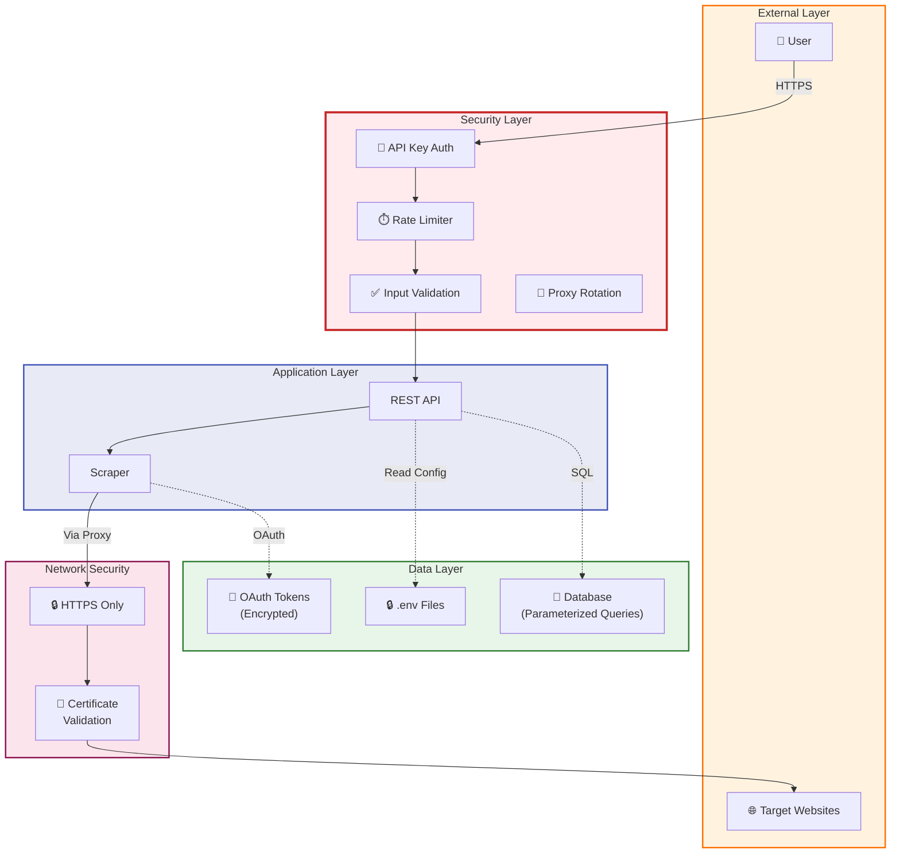

### 9.2 Security Measures

#### 9.1.1 **Credential Management**
- Store API keys in `.env` file (not in code)
- Use `python-dotenv` for environment variables
- `.gitignore` prevents credential commits
- OAuth tokens stored encrypted

#### 9.1.2 **API Security**
- API key authentication for REST endpoints
- Rate limiting (100 requests/minute per key)
- Input validation with Pydantic
- SQL injection prevention via parameterized queries

#### 9.1.3 **Network Security**
- HTTPS for all external communications
- Certificate validation
- Proxy support for anonymous scraping

### 9.2 Privacy Considerations

- **Robots.txt Compliance**: Optional respect for robots.txt
- **Rate Limiting**: Prevent server overload
- **User-Agent**: Identify scraper to target sites
- **Data Retention**: Configurable data deletion policies

---

## 10. Scalability & Performance

### 10.1 Scalability Evolution

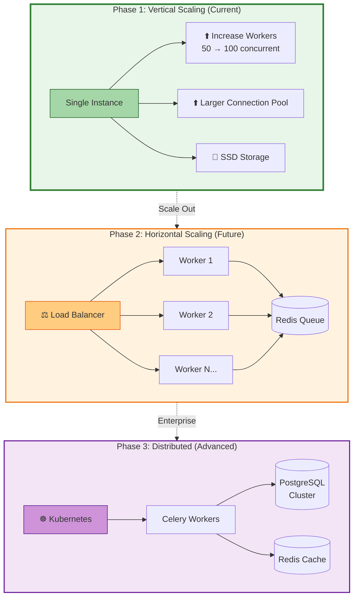

### 10.2 Performance Targets

| Metric | Target | Measurement |
|--------|--------|-------------|
| **Concurrent Requests** | 100+ | aiohttp session pooling |
| **Pages/Minute** | 500+ | With 50 concurrent workers |
| **Memory Usage** | < 500MB | For 10K records in memory |
| **Database Size** | 1GB+ | SQLite supports up to 281TB |
| **API Response Time** | < 200ms | P95 for read operations |

### 10.2 Scalability Strategies

#### 10.2.1 **Horizontal Scaling** (Future)
- Multiple worker instances
- Redis-based job queue
- Distributed task coordination with Celery

#### 10.2.2 **Vertical Scaling** (Current)
- Increase concurrent workers
- Larger connection pools
- SSD for faster database I/O

#### 10.2.3 **Caching**
- In-memory caching of frequently accessed data
- HTTP response caching (with TTL)
- Database query result caching

---

## 11. Error Handling & Resilience

### 11.1 Error Handling Flow

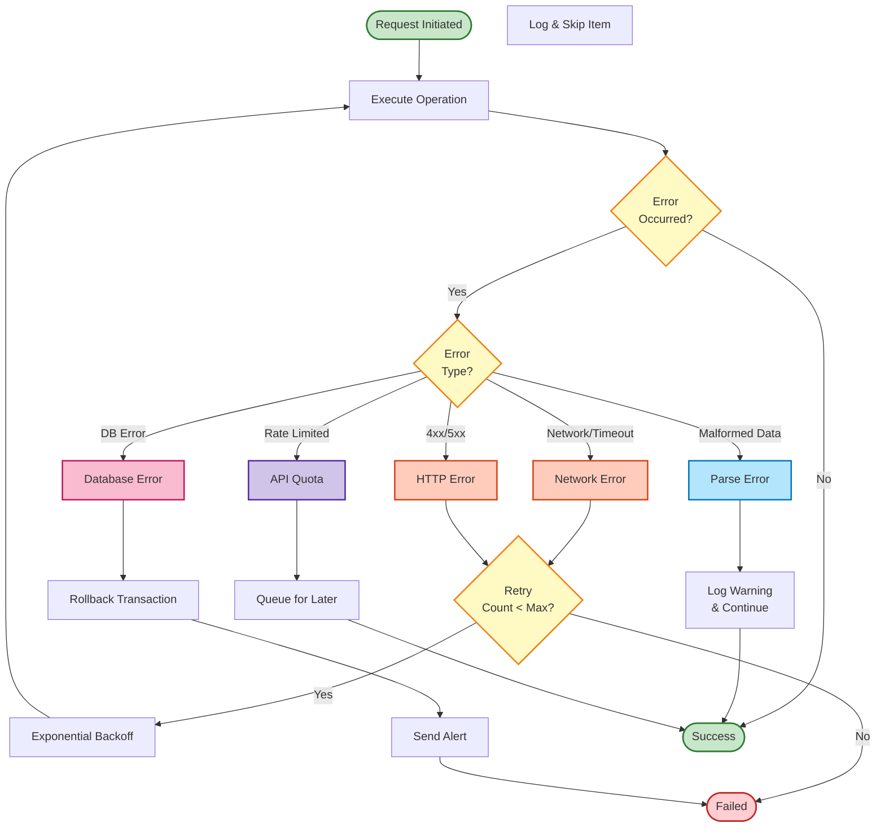

### 11.2 Error Categories

| Error Type | Handling Strategy | Example |
|------------|-------------------|---------|
| **Network Errors** | Retry with exponential backoff | Connection timeout |
| **HTTP Errors** | Log and skip (4xx), retry (5xx) | 404, 503 |
| **Parsing Errors** | Log warning, continue | Malformed HTML |
| **API Quota** | Queue and retry after delay | Google Sheets quota |
| **Database Errors** | Rollback transaction, alert | Disk full |

### 11.2 Retry Logic

```python
@retry(
    stop=stop_after_attempt(3),
    wait=wait_exponential(multiplier=1, min=2, max=10),
    retry=retry_if_exception_type((aiohttp.ClientError, asyncio.TimeoutError))
)
async def fetch_with_retry(url: str):
    pass
```

### 11.3 Circuit Breaker Pattern

- After 5 consecutive failures, stop requests to failing domain
- Wait 60 seconds before retry
- Prevents cascading failures

---

## 12. Deployment Architecture

### 12.1 Deployment Options Overview

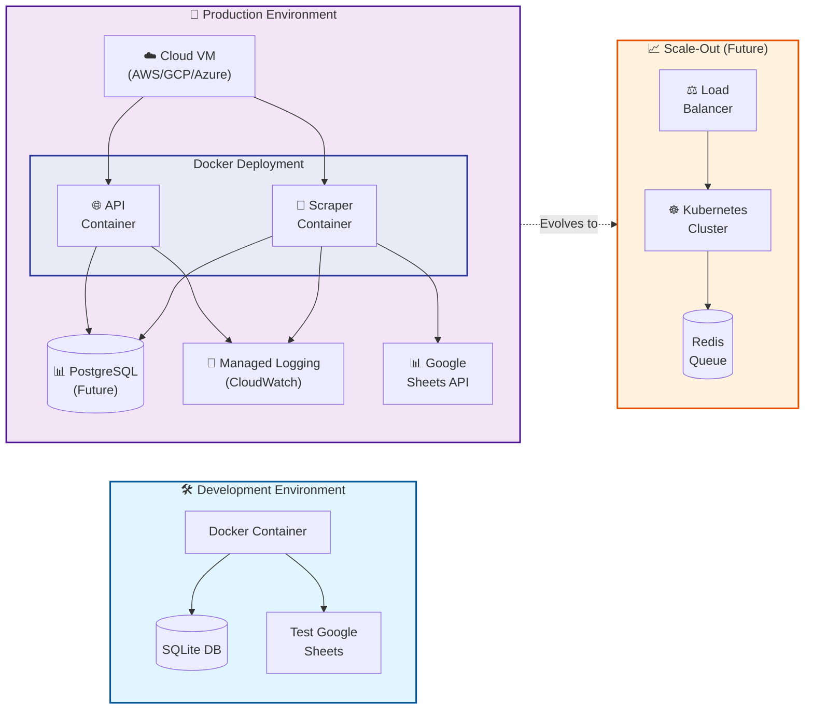

### 12.2 Docker Container Architecture

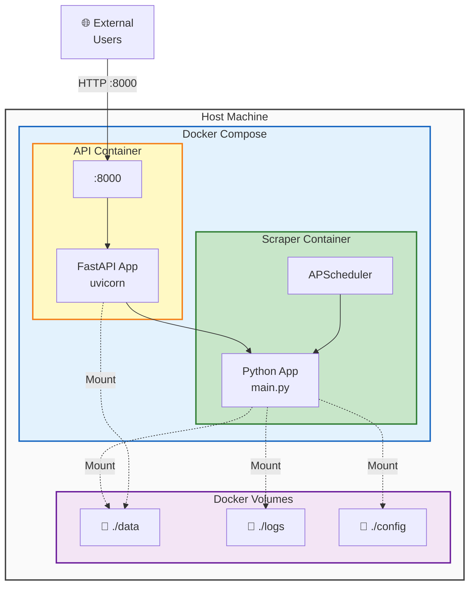

### 12.3 Docker Deployment

#### Dockerfile
```dockerfile
FROM python:3.11-slim

WORKDIR /app

# Install dependencies
COPY requirements.txt .
RUN pip install --no-cache-dir -r requirements.txt

# Copy application
COPY . .

# Create volumes for data persistence
VOLUME ["/app/data", "/app/logs", "/app/config"]

CMD ["python", "main.py"]
```

#### docker-compose.yml
```yaml
version: '3.8'

services:
  scraper:
    build: .
    container_name: data-sentry
    environment:
      - LOG_LEVEL=INFO
      - ENABLE_SCHEDULER=true
    volumes:
      - ./data:/app/data
      - ./logs:/app/logs
      - ./config:/app/config
    env_file:
      - .env
    restart: unless-stopped
    
  api:
    build: .
    container_name: data-sentry-api
    command: uvicorn api.app:app --host 0.0.0.0 --port 8000
    ports:
      - "8000:8000"
    depends_on:
      - scraper
    env_file:
      - .env
    restart: unless-stopped
```

### 12.2 Deployment Environments

#### 12.2.1 **Development**
- Local Docker container
- SQLite database
- Test Google Sheets account

#### 12.2.2 **Production**
- Cloud VM (AWS EC2, GCP Compute, Azure VM)
- Docker Swarm or Kubernetes (for scale)
- External PostgreSQL (future)
- Managed logging (CloudWatch, Stackdriver)

---

## 13. Monitoring & Logging

### 13.1 Observability Architecture

```mermaid
flowchart TB
    subgraph Application["Application Components"]
        SCRAPER["Scraper Engine"]
        API["REST API"]
        SCHEDULER["Scheduler"]
        ALERTS["Alert System"]
    end
    
    subgraph Logging["Logging Layer"]
        LOGGER["Python Logger<br/>(colorlog)"]
        FILE_LOG["File Handler<br/>logs/scraper.log"]
        CONSOLE_LOG["Console Handler<br/>(stdout)"]
    end
    
    subgraph Metrics["Metrics Collection"]
        COUNTER["Counters<br/>- Jobs Total<br/>- Records Fetched<br/>- Errors Total"]
        HISTOGRAM["Histograms<br/>- Job Duration<br/>- Response Time"]
        GAUGE["Gauges<br/>- Active Workers<br/>- Queue Size"]
    end
    
    subgraph Health["Health Checks"]
        LIVENESS["Liveness Probe<br/>/health/live"]
        READINESS["Readiness Probe<br/>/health/ready"]
        DEPS["Dependencies Check<br/>- Database<br/>- Google Sheets API"]
    end
    
    subgraph Monitoring["Monitoring (Future)"]
        PROMETHEUS["Prometheus"]
        GRAFANA["Grafana Dashboard"]
        ALERTS_MON["Alert Manager"]
    end
    
    SCRAPER --> LOGGER
n    API --> LOGGER
    SCHEDULER --> LOGGER
    ALERTS --> LOGGER
    
    LOGGER --> FILE_LOG
    LOGGER --> CONSOLE_LOG
    
    SCRAPER -.->|Emit| COUNTER
    SCRAPER -.->|Emit| HISTOGRAM
    API -.->|Emit| GAUGE
    
    API --> LIVENESS
    API --> READINESS
    READINESS --> DEPS
    
    COUNTER -.->|Future| PROMETHEUS
    HISTOGRAM -.->|Future| PROMETHEUS
    GAUGE -.->|Future| PROMETHEUS
    PROMETHEUS -.-> GRAFANA
    PROMETHEUS -.-> ALERTS_MON
    
    style Application fill:#e3f2fd,stroke:#1565c0,stroke-width:3px
    style Logging fill:#fff3e0,stroke:#e65100,stroke-width:3px
    style Metrics fill:#f3e5f5,stroke:#6a1b9a,stroke-width:3px
    style Health fill:#c8e6c9,stroke:#2e7d32,stroke-width:3px
    style Monitoring fill:#ffebee,stroke:#c62828,stroke-width:2px,stroke-dasharray: 5 5
    
    style LOGGER fill:#ffb74d,stroke:#e65100,stroke-width:2px
    style COUNTER fill:#ba68c8,stroke:#6a1b9a,stroke-width:2px
    style HISTOGRAM fill:#ba68c8,stroke:#6a1b9a,stroke-width:2px
    style GAUGE fill:#ba68c8,stroke:#6a1b9a,stroke-width:2px
    style LIVENESS fill:#81c784,stroke:#2e7d32,stroke-width:2px
    style READINESS fill:#81c784,stroke:#2e7d32,stroke-width:2px
```

### 13.2 Logging Strategy

#### Log Levels
- **DEBUG**: Detailed diagnostic info
- **INFO**: Scrape job start/end, records processed
- **WARNING**: Retries, missing data
- **ERROR**: Failed requests, parsing errors
- **CRITICAL**: System failures

#### Log Format
```
2025-11-29 10:30:15 [INFO] scraper.fetcher - Fetching 100 URLs
2025-11-29 10:30:18 [WARNING] scraper.parser - Missing selector: price
2025-11-29 10:30:20 [ERROR] sheets.sync - API quota exceeded, retrying in 60s
```

### 13.2 Metrics Collection

| Metric | Type | Purpose |
|--------|------|---------|
| `scrape_jobs_total` | Counter | Total jobs executed |
| `scrape_records_fetched` | Counter | Total records scraped |
| `scrape_errors_total` | Counter | Total errors |
| `scrape_duration_seconds` | Histogram | Job duration distribution |
| `http_requests_total` | Counter | HTTP requests made |
| `sheets_api_calls_total` | Counter | Google Sheets API usage |

### 13.3 Health Checks

- **Liveness**: Is the service running?
- **Readiness**: Can it accept requests?
- **Dependency**: Are external services (Sheets API) accessible?

---

## 14. Future Enhancements

### 14.1 Product Roadmap

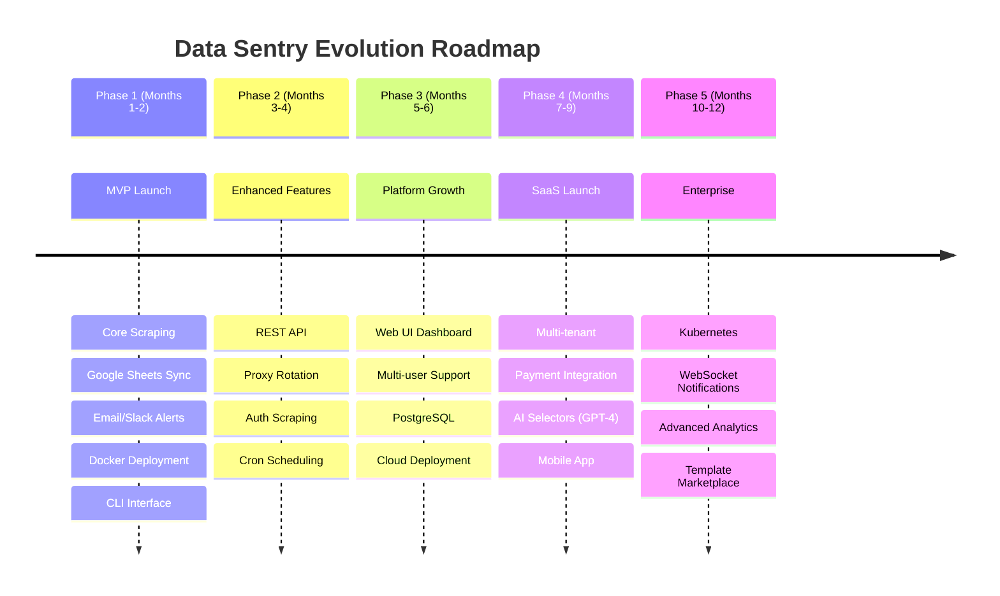

### 14.2 Feature Evolution

```mermaid
flowchart LR
    subgraph MVP["Phase 1: MVP"]
        CORE["Core Scraping"]
        SHEETS["Google Sheets"]
        BASIC_ALERT["Basic Alerts"]
    end
    
    subgraph Enhanced["Phase 2: Enhanced"]
        API["REST API"]
        PROXY["Proxy System"]
        AUTH["Auth Scraping"]
    end
    
    subgraph Platform["Phase 3: Platform"]
        WEB_UI["Web Dashboard"]
        MULTI_USER["Multi-user"]
        POSTGRES["PostgreSQL"]
    end
    
    subgraph SaaS["Phase 4: SaaS"]
        TENANT["Multi-tenant"]
        PAYMENT["Payments"]
        AI["AI Features"]
    end
    
    subgraph Enterprise["Phase 5: Enterprise"]
        K8S["Kubernetes"]
        WEBSOCKET["Real-time"]
        ANALYTICS["Analytics"]
    end
    
    MVP --> Enhanced
    Enhanced --> Platform
    Platform --> SaaS
    SaaS --> Enterprise
    
    style MVP fill:#c8e6c9,stroke:#2e7d32,stroke-width:3px
    style Enhanced fill:#fff9c4,stroke:#f57f17,stroke-width:3px
    style Platform fill:#90caf9,stroke:#0d47a1,stroke-width:3px
    style SaaS fill:#ce93d8,stroke:#6a1b9a,stroke-width:3px
    style Enterprise fill:#ffab91,stroke:#d84315,stroke-width:3px
```

### 14.3 Detailed Phase Breakdown

### Phase 1 (Months 1-2)
- ✅ MVP: Core scraping + Sheets + Alerts
- ✅ Docker deployment
- ✅ CLI interface

### Phase 2 (Months 3-4)
- 🔲 REST API implementation
- 🔲 Proxy rotation system
- 🔲 Authenticated scraping (login flows)
- 🔲 Advanced scheduling (cron expressions)

### Phase 3 (Months 5-6)
- 🔲 Web UI dashboard (React/Vue)
- 🔲 Multi-user support
- 🔲 PostgreSQL support
- 🔲 Cloud deployment (AWS/GCP)

### Phase 4 (Months 7-9)
- 🔲 SaaS multi-tenant version
- 🔲 Stripe payment integration
- 🔲 AI-powered selector generation (GPT-4)
- 🔲 Mobile app (React Native)

### Phase 5 (Months 10-12)
- 🔲 Distributed scraping (Kubernetes)
- 🔲 Real-time WebSocket notifications
- 🔲 Advanced analytics dashboard
- 🔲 Marketplace for scraping templates

---

## Appendix A: Configuration File Schema

### config.yaml
```yaml
scraper:
  max_concurrent: 50
  timeout: 30
  retry_attempts: 3
  rate_limit: 1.0
  user_agent: "Mozilla/5.0 (Data Sentry/1.0)"
  
selectors:
  product:
    name: "h1.product-title"
    price: "span.price"
    stock: "div.availability"
    
storage:
  type: "both"  # csv, db, both
  csv_path: "data/products.csv"
  db_path: "data/scraper.db"
  
sheets:
  enabled: true
  credentials: "config/credentials.json"
  sheet_name: "Product Prices"
  
alerts:
  email:
    enabled: true
    recipients: ["user@example.com"]
  slack:
    enabled: true
    webhook_url: "${SLACK_WEBHOOK_URL}"
  discord:
    enabled: false
    
scheduler:
  enabled: true
  interval: 3600  # 1 hour
```

---

## Appendix B: Testing Strategy

### Unit Tests
- Test each module in isolation
- Mock external dependencies (HTTP, Sheets API)
- Target: 80%+ code coverage

### Integration Tests
- Test end-to-end workflows
- Use test database
- Test Google Sheets integration with test account

### Performance Tests
- Load test with 1000+ URLs
- Memory profiling
- Concurrent request stress testing

---

## Document Revision History

| Version | Date | Author | Changes |
|---------|------|--------|---------|
| 1.0 | 2025-11-29 | Ali Haidar | Initial HLD document |

---

**END OF HIGH-LEVEL DESIGN DOCUMENT**
